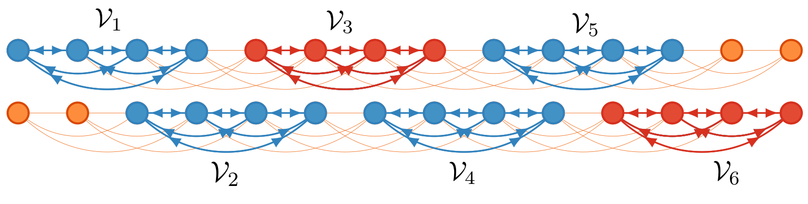
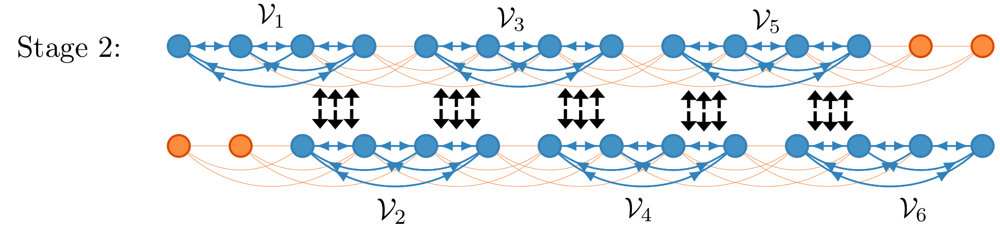

[Home](https://chenyx04.github.io/Spectral-Stitching/)  
[Description](https://chenyx04.github.io/Spectral-Stitching/Description)  
[Quick Start](https://chenyx04.github.io/Spectral-Stitching/users_guide)

# Haplotype Phasing

Humans have 23 pairs of homologous chromosomes, which are identical except on certain positions called single nucleotide polymorphisms (SNPs). A haplotype of an individual is the pair of sequences of SNPs on the two homologous chromosomes. Knowing the haplotypes of individuals can lead to a better understanding of the interplay of genetic variation and disease as well as better inference of human demographic history. The haplotype phasing problem is that of inferring haplotypes of individuals from high-throughput sequencing data. 

The Spectral-Stitching algorithm consists of three stages:

**Stage 1: node splitting and spectral estimation.**  Split all nodes into several *overlapping* subsets, and run spectral
methods separately on each subgraph induced by each vertex subset, in the hope of achieving approximate estimates for each subgraph. 

 
 

 

**Stage 2: stiching the estimates.**  The aim of this stage is to stitch together the outputs of Stage 1
computed in isolation for the collection of overlapping subgraphs, so as to ensure that they have matching global phases. 

 
 

 

**Stage 3: successive local refinement.**  Clean up all estimates using both backward and
forward samples in order to maximize recovery accuracy. This is achieved by running local majority
voting from the neighbors of each vertex until convergence. 

 

 

Details can be found in the following paper:

* Yuxin Chen, Govinda Kamath, Changho Suh, and David Tse,  "[Community recovery in graphs with locality](http://proceedings.mlr.press/v48/chena16.html)," *International Conference on Machine Learning*, pp. 689-698, June 2016.

