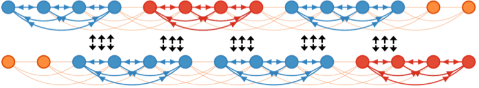

[Home](https://chenyx04.github.io/Spectral-Stitching/)  
[Description](https://chenyx04.github.io/Spectral-Stitching/Description)  
[Algorithm](https://chenyx04.github.io/Spectral-Stitching/Algorithm)  
[Quick Start](https://chenyx04.github.io/Spectral-Stitching/users_guide)

# Spectral-Stitching Algorithm for Haplotype Phasing

 
 

 

This repository implements the Spectral-Stitching algorithm for [haplotype phasing](Description.md) proposed in:

* Yuxin Chen, Govinda Kamath, Changho Suh, and David Tse,  "[Community recovery in graphs with locality](http://proceedings.mlr.press/v48/chena16.html)," *International Conference on Machine Learning*, pp. 689-698, June 2016.
  * [Paper (ICML)](http://www.princeton.edu/~yc5/publications/Locality_ICML.pdf)
  * [Paper (Arxiv)](https://arxiv.org/abs/1602.03828)
  * [Slides (Computational Genomics Summer Institute)](http://www.princeton.edu/~yc5/slides/cgsi_talk_np.pptx) 
  * [Slides (International Conference on Machine Learning)](http://www.princeton.edu/~yc5/slides/Locality_ICML_slides.pdf)  
  * [Github Repo](https://github.com/chenyx04/Spectral-Stitching)

The design of the Spectral-Stitching algorithm leverages connections between haplotype phasing and the problem of [**_community detection_**](Description.md), where communities have to be inferred based on the friendship graph of users. The algorithm is shown to be efficient especially when the coverage is relatively deep (at least > 5X). 

The main program is implemented in Python. An evaluation program (implemented in MATLAB and R) is also provided for evaluating the phasing accuracy on NA12878 WGS data (see [10X paper](https://www.ncbi.nlm.nih.gov/pmc/articles/PMC4786454/)).

If you have any questions, feel free to contact 

[Banghua Zhu](mailto:13aeon.v01d@gmail.com), Tsinghua University   
[Yuxin Chen](mailto:yuxin.chen@princeton.edu), Princeton University  
[David Tse](mailto:dntse@stanford.edu), Stanford University

